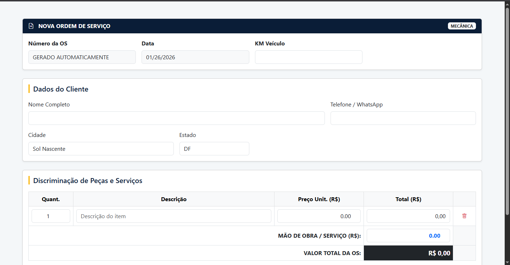

# 🛡️ Reicar Management System

O **Reicar Management System** é uma solução robusta para a gestão operacional de oficinas mecânicas e borracharias.  
O projeto foca em simplificar fluxos complexos de faturamento e ordens de serviço, unindo uma interface intuitiva a um backend escalável, coeso e rigorosamente tipado.

---

## 📦 Status do Projeto
🚧 **Em desenvolvimento ativo** — novas features, refatorações arquiteturais e melhorias de qualidade em andamento.

---

## 🚀 Diferenciais Técnicos (Foco em Excelência)

Este projeto foi desenvolvido aplicando padrões de mercado para garantir **manutenibilidade, performance e clareza arquitetural**:

- **Arquitetura de Injeção Moderna**  
  Injeção de Dependência via construtor utilizando `@RequiredArgsConstructor` (Lombok), promovendo imutabilidade, baixo acoplamento e facilidade em testes unitários.

- **Herança JPA com SINGLE_TABLE (Estratégia de Mercado)**  
  Uso de `@Inheritance(strategy = InheritanceType.SINGLE_TABLE)` com `@DiscriminatorColumn`,  
  permitindo especialização de Ordens de Serviço (Mecânica e Borracharia)  
  sem impacto em performance ou complexidade excessiva no schema.

- **Separação de Responsabilidades (DTOs)**  
  Utilização de **DTOs baseados em Records** para isolar a camada de persistência da camada de apresentação, reduzindo vazamento de regras de domínio.

- **UX Tátil e Mobile-Friendly**  
  Interface construída com **Bootstrap 5**, priorizando áreas de toque para uso em ambiente de oficina.  
  Cálculos dinâmicos em tempo real com JavaScript evitam erros humanos no faturamento.

- **Dashboard de Gestão Premium**  
  Painel administrativo com **KPIs em tempo real** (Volume de OS, Faturamento Bruto e Mão de Obra), utilizando agregações do Thymeleaf para evitar múltiplas consultas desnecessárias ao banco.

- **Persistência Transacional**  
  Uso de `@Transactional` para garantir atomicidade no salvamento de clientes e ordens vinculadas.

- **Gestão de Migrations com Flyway**  
  Versionamento rigoroso do schema MySQL, garantindo evolução segura da estrutura do banco de dados.

- **Validação de Dados Nacional**  
  Integração com `caelum-stella-bean-validation` para validação nativa de documentos brasileiros (CPF/CNPJ).

---

## 🛠️ Stack Tecnológica

- **Backend**: Java 21 (LTS), Spring Boot 3.5.0, Spring Data JPA  
- **Frontend**: Thymeleaf, JavaScript (Vanilla), Bootstrap 5  
- **Banco de Dados**: MySQL 8  
- **Relatórios**: OpenPDF (exportação de Ordens de Serviço em PDF)  
- **Produtividade**: Maven, Lombok, Flyway  

---

## 📈 Funcionalidades Implementadas

- **Gestão de Utilizadores** (Com permissoes: ADMIN, MECANICO e USER)
- **Configuração de Política de Garantia** (Garantia de serviço em quantidade de dias) 

### 🧠 Triagem de Entrada Inteligente
Fluxos distintos de abertura de Ordens de Serviço (OS):

- **Mecânica** (controle de KM e Diagnóstico)
- **Borracharia** (posição e troca de pneus)

📸 *Exemplo da tela de abertura de OS*  

### 📊 Dashboard Operacional
Resumo financeiro e operacional com status visual das Ordens de Serviço (**Aberta / Finalizada**).

📸 *Dashboard administrativo*  


---



---

### 📄 Exportação em PDF
Geração de documentos profissionais para entrega ao cliente final.

📸 *Exemplo de OS em PDF*  


---

### 🧮 Cálculos Automáticos
Aplicação dinâmica de valores com suporte a múltiplos itens e cálculo integrado de mão de obra, evitando erros manuais.

---

## 🔐 Segurança
Atualmente o sistema **não possui autenticação/autorização**.  
A inclusão de **Spring Security** está planejada para versões futuras do projeto.

---

## 🧪 Testes
No momento, o projeto **ainda não possui testes automatizados**.  
A estrutura já está preparada para inclusão de **JUnit 5 e Mockito**, conforme definido no roadmap.

---

## 🚀 Roadmap de Evolução

- [ ] **Testes Automatizados**  
  Implementação de cobertura com JUnit 5 e Mockito.

- [X] **Dockerização**  
  Criação de ambiente orquestrado com Docker Compose.

- [ ] **Rich Domain Model**  
  Refatoração para mover regras de markup e cálculos financeiros diretamente para as entidades de domínio.

- [ ] **Documentação de API**  
  Implementação de Swagger / OpenAPI.

---

## ⚙️ Como Executar

### Pré-requisitos
- Java 21  
- MySQL 8  

### Configuração
Ajuste as variáveis de conexão no arquivo `application.yml`.

### Execução
```bash
./mvnw spring-boot:run
```

---

## 📄 Licença
Este projeto está sob a licença **MIT**.

---

**Desenvolvedor**: Josué Vítor França Lisboa
**Foco**: Backend Java · Spring Framework · Arquitetura de Software  

🔗 LinkedIn: https://www.linkedin.com/in/jvfrancalisboa/  
🐙 GitHub: https://github.com/JVFrancaLisboa
